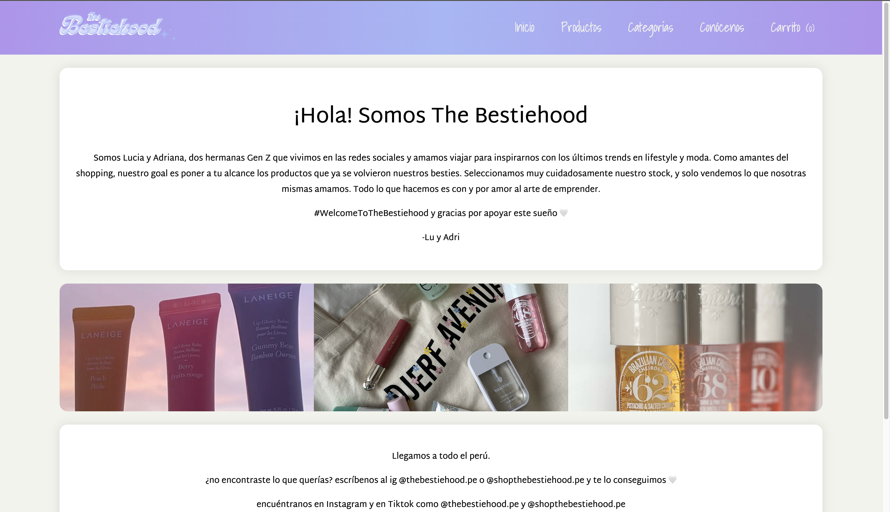

<div align="center">

  
  <h1>E-commerce-Front (The Bestiehood)</h1>

  <h2>
   :star: <a href="https://bestiehood.vercel.app/">Check out the website</a> :star:
  </h2> 
  
</div>

<!-- Table of Contents -->

# :notebook_with_decorative_cover: Table of Contents

- [:notebook\_with\_decorative\_cover: Table of Contents](#notebook_with_decorative_cover-table-of-contents)
  - [:star2: About the Project](#star2-about-the-project)
    - [:notebook: Description](#notebook-description)
    - [:eyes: Features](#eyes-features)
    - [:camera: Screenshot](#camera-screenshot)
    - [:space\_invader: Tech Stack](#space_invader-tech-stack)
    - [:key: Environment Variables](#key-environment-variables)
  - [:toolbox: Getting Started](#toolbox-getting-started)
    - [:bangbang: Prerequisites](#bangbang-prerequisites)
    - [Setup](#setup)

<!-- About the Project -->

## :star2: About the Project

<!-- Description -->

### :notebook: Description

<p>
Fullstack e-commerce built for a Peruvian business specialicing in importing makeup, skincare and perfume!
</p>

<!-- Features -->

### :eyes: Features

- Admin creates products, categories, brands etc., via E-commerce-Admin.
- E-commerce-Front fetches the data using mongoose models from E-commerce-Shared.
- Accepts Visa, Mastercard, Amex, Discover, and Union Pay.
- Filter and search products by name, color, size, and more.
- Delivery fee based on address.
- A purchase generate an order that is sent to eCommerce-Admin for packing and shipping.
- Stock updates automatically when a purchase is made.

<!-- Screenshots -->

### :camera: Screenshot

<div align="center"> 
 
</div>

<!-- TechStack -->

### :space_invader: Tech Stack

 <ul>
    <li><a href="https://www.javascript.com/">JavaScript</a></li>
    <li><a href="https://nodejs.org/">Node.js</a></li>
    <li><a href="https://nextjs.org/">Next.js</a></li>
    <li><a href="https://react.dev/">React.js</a></li>
    <li><a href="https://www.mongodb.com/">MongoDB</a></li>
    <li><a href="https://styled-components.com/">Styled Components</a></li>
    <li><a href="https://stripe.com/">Stripe</a></li>
  </ul>

<!-- Env Variables -->

### :key: Environment Variables

To run this project, you will need to add the following environment variables to your .env file

`MONGODB_URI`

`STRIPE_SECRET_KEY`

`STRIPE_PUBLIC_KEY`

`NEXT_PUBLIC_APP_URL`

`WEBHOOK_SIGNING_SECRET`

<!-- Getting Started -->

## :toolbox: Getting Started

<!-- Prerequisites -->

### :bangbang: Prerequisites

 <ul>
   <li><a href="https://stripe.com/">Stripe</a></li>
   <li><a href="https://www.mongodb.com/">Mongo DB</a></li>
 </ul>

### Setup

Clone the project

```bash
  git clone https://github.com/nidorbRotkiv/eCommerce-Front.git
```

yarn commands

```bash
# install dependencies
$ yarn install

# serve with hot reload at localhost:3001
$ yarn dev
```

For detailed explanation on how things work, check out the [documentation](https://nextjs.org/).
